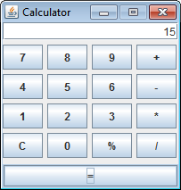

#calculator example

## Overview

This example takes advantage of the **calculator** example web service that is built into
RTCP and includes:
 
- A Java calculator application which uses the *calculator* web service to perform mathematical calculations.
Though the application itself remains unchanged, it can be launched in one of two modes.
	- Normal mode where it connects directly to the web service
	- Test mode, where trafic is routed through through a RIT proxy. 
	This facilitates both tracing at the operational level and use of the stubs provided.	

	

- A RIT project which contains
	- A test suite which exercises basic calculator operations of the web service.
	- A stub which simulates all of the operations of the calculator web service
    - 
A partial stub which lets most operations [pass-through](http://www-01.ibm.com/support/knowledgecenter/SSBLQQ_8.6.0/com.ibm.rational.rtvs.ref.doc/topics/c_rtvsref_sift_passthrough.html?lang=en "sift-and-pass-through") to the actual web service
      but intercepts a specific operation to return an unexpected value

Integrated web service examples may be found at [http://localhost:7819/RTCP/examples/](http://localhost:7819/RTCP/examples/)
The *Calculator* web service provides stateless methods Add, Divide, Modulus, Multiply and Substract.

The definition of the service can be found here [http://localhost:7819/RTCP/examples/calculator/calculatorService/calculator.wsdl]([http://localhost:7819/RTCP/examples/calculator/calculatorService/calculator.wsdl])
It is this definition that was used to create the test.  

## What's included?

A java application, calculator, which will exercise the Calculator example web service. 

 
A Rational Integration Tester (RIT) project which contains:
 - a test suite which tests the basic functionality of the RTCP's calculator web service.
 - a monitor definition to facilitate  
 
## Installation Instructions (DevOps Services)
- Right click the  **calculator** folder , then Export->download->Zip
- When downloaded, unzip it
- Download the required Axis2 libraries from [http://axis.apache.org/axis2/java/core/download.cgi#a1_6_2](http://axis.apache.org/axis2/java/core/download.cgi#a1_6_2) and unzip into the calculator/applications/client folder

    calculator
        rit-projects
            rit-project-calculator.zip
        applications
            client
                axis-1.6.2
                com.ibm.greenhat.examples.calculator.jar
                startCalculator.bat  
                startCalculatorInTestMode.bat 
                
- Unzip rit-projects/rit-project-calculator.zip. This contains a RIT project calculator.ghp

## Basic usage
- Start RIT
- Select Open, then navigate to the calculator/calculator.ghp file 
- Go to "Test Lab" (F11)
- Right click on Suites/BasicTests
- The BasicTests suite, which consists of 5 tests shows 100% complete.

##Further reading
 - TechNote : [Message filtering and validation](http://www-01.ibm.com/support/docview.wss?uid=swg21669000)
 - developerWorks article :  [Virtualize multiple behaviors in parallel with Rational Test Virtualization Server](http://www.ibm.com/developerworks/rational/library/multiple-behaviors-parallel-test-virtualization-server/index.html)